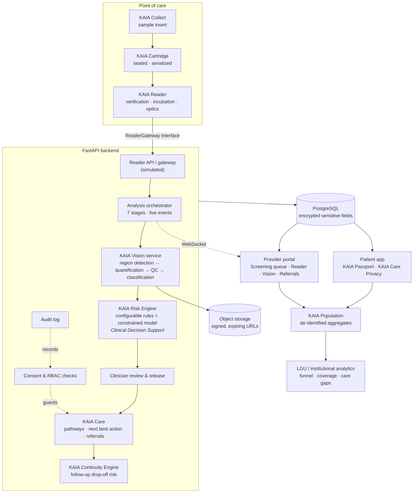
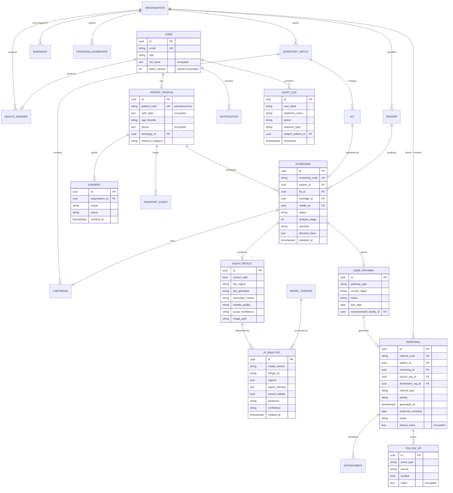
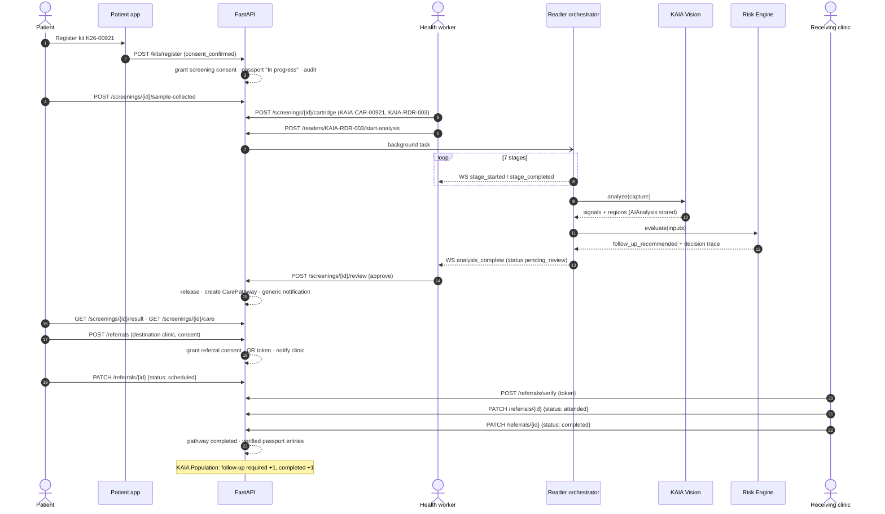
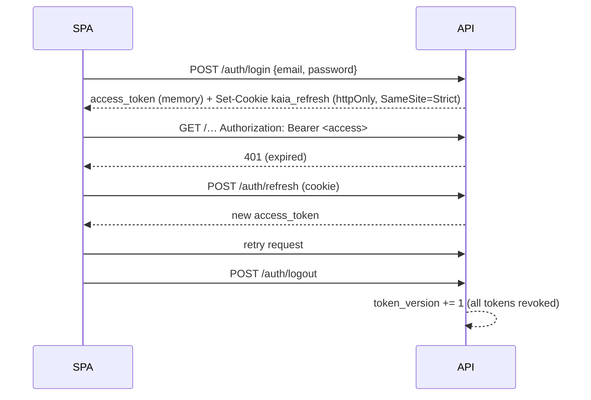
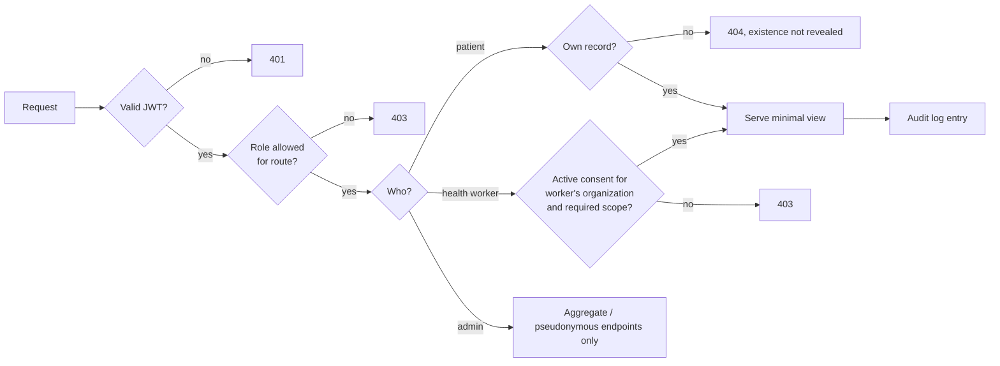

# KAIA Architecture

KAIA is a modular monolith: one FastAPI service backed by PostgreSQL, with a React single-page app. Every AI and hardware component is isolated behind an interface inside `backend/app/services/`, so a trained model or a physical KAIA Reader can replace a simulator without changing routes, schemas or the UI.

## 1. System architecture

## 2. Module map (backend)

| Module | Responsibility |
|---|---|
| `core/config.py` | Settings from environment |
| `core/security.py` | bcrypt hashing, JWT access/refresh tokens, HMAC signed file URLs, QR referral tokens |
| `core/crypto.py` | `EncryptedString` column type (Fernet / MultiFernet, key rotation) |
| `core/deps.py` | Authentication dependency and `require_roles(...)` |
| `services/access.py` | **Consent-based access control**: `ensure_screening_access`, `ensure_referral_access`, `ensure_org_scope` |
| `services/audit.py` | Append-only access logging (never health values) |
| `services/screening.py` | Kit registration, sample receipt, cartridge registration, clinician release |
| `services/analysis.py` | Seven-stage reader orchestration, persisted progress, live events, crash recovery |
| `services/reader/` | `ReaderGateway` interface, simulator, synthetic assay image renderer |
| `services/vision/` | `VisionModel` interface and simulated model |
| `services/risk_engine.py` | Rule schema and validation, evaluation, constrained model, decision trace |
| `services/care.py` | Care pathway lifecycle, next best action, referral state machine, passport updates |
| `services/continuity.py` | Feature extraction and follow-up drop-off prediction |
| `services/analytics.py` | Program aggregation, funnel, barangay breakdown, monthly cohorts, care-gap detection, CSV export |
| `services/storage.py` | `StorageBackend` (local; S3/MinIO-ready) |
| `services/events.py` | Reader event bus (in-process; Redis-ready) |

## 3. AI and decision-support design

| Service | Output | Constraint |
|---|---|---|
| KAIA Vision | Control validity, HPV signal, genotype channel, secondary biomarker, sample quality, assay confidence, regions, intensities | Signals only. It never produces a disease probability. |
| KAIA Risk Engine | `routine_screening` · `follow_up_recommended` · `priority_follow_up` | Rules first, and the most protective matching rule wins. The model may escalate follow-up to priority but can never lower an outcome. Every result requires clinician review before release. A full decision trace is stored. |
| KAIA Continuity Engine | `HIGH` / `MEDIUM` / `LOW` risk of not completing follow-up, a reason and an intervention | Predicts care drop-off, never disease. Shown only to providers and administrators. |

If the Vision quality gate fails (invalid control or poor sample), no screening outcome is generated. The patient is asked to recollect, and the message states that this is not a result.

## 4. Database ERD

Configuration tables not shown as relationships:

- `risk_rules`: configurable Risk Engine rules
- `pathway_configs`: KAIA Care recommendations and patient messaging per outcome
- `model_versions`: AI model registry

## 5. API flows

### 5.1 End-to-end screening → completed care

### 5.2 Authentication and session refresh

### 5.3 Consent-checked data access

### 5.4 QR referral verification

The QR code encodes `…/portal/referrals/scan?token=<referral-id>.<hmac>`. The token contains no health data. `POST /referrals/verify` checks the HMAC, then applies `ensure_referral_access`. Only the source or destination facility can open the referral, and only with the patient's consent. Every scan is audited.

## 6. KAIA Population data model

Program totals combine two sources:

1. **`program_aggregates`**: de-identified monthly counts per barangay imported from pre-platform records (kits distributed, samples returned, valid screenings, follow-up required and completed, total days to follow-up).
2. **Live platform records**: kits, screenings and care pathways, counted at query time.

Screening-derived metrics are grouped by **month of result** (cohorts), so referral completion for recent months naturally reads as "in progress". Care-gap detection compares each barangay with the city:

- participation more than 15 points below the city average
- follow-up completion below 60%
- sample return below 70%
- average time to follow-up above 45 days

CSV exports suppress counts from 1 to 4.

## 7. Deployment

`docker-compose.yml` runs PostgreSQL, the API and an nginx container that serves the SPA and proxies `/api`, including the WebSocket upgrade. For production:

- set strong `JWT_SECRET`, `FIELD_ENCRYPTION_KEY` and `FILE_URL_SECRET`
- set `ENVIRONMENT=production`, which disables the demo reset
- terminate TLS, set `COOKIE_SECURE=true` and enable HSTS
- move storage to S3/MinIO and reader events to Redis before scaling horizontally
